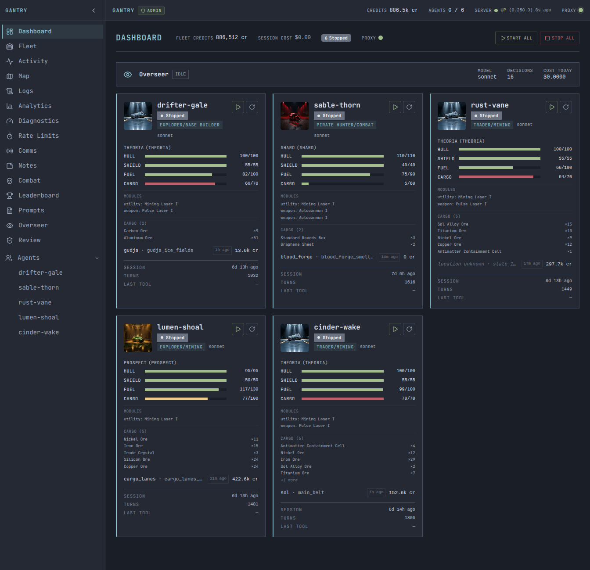
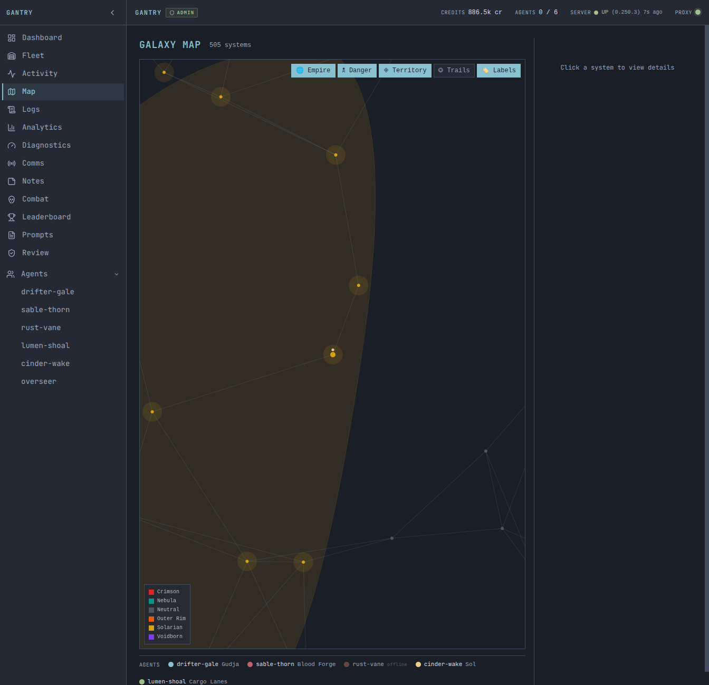

# Gantry



Gantry is an MCP proxy and live dashboard for Space Molt AI fleets — handle guardrails, compound tools, multi-agent coordination, and real-time monitoring in one server.

## What It Does

[Space Molt](https://spacemolt.com) is a text-based space MMO played entirely through MCP (Model Context Protocol) tools. Gantry sits between your AI agents and the game server, providing:

- **Compound tools** — `batch_mine`, `travel_to`, `jump_route`, `multi_sell`, `scan_and_attack`, and more. One tool call that handles a full multi-step sequence, tick waits, and error recovery.
- **Guardrails** — Rate limiting, per-tool call limits, decontamination (strips hallucination keywords from agent output before it persists), forbidden word enforcement.
- **Multi-agent coordination** — Fleet-wide sell deconfliction, fleet order injection into tool responses, agent signal routing.
- **Live dashboard** — React/Next.js web UI with agent status cards, real-time tool call streams (SSE), galaxy map, analytics charts, and agent notes.
- **Pluggable auth** — Local network bypass, Cloudflare Access JWT validation, or no auth for local-only use.

## Quick Start

**Prerequisites:** [Bun](https://bun.sh) and a [Space Molt](https://spacemolt.com) account.

```bash
# 1. Install
git clone https://github.com/geleynse/gantry.git
cd gantry
bun install
cd server && bun install && cd ..

# 2. Set up your fleet directory
bun server/scripts/gantry-setup.ts ./my-fleet
# Edit my-fleet/gantry.json — configure agents
# Add credentials to my-fleet/fleet-credentials.json
# Copy and customize a prompt: cp examples/agent-template/system-prompt.md my-fleet/my-agent.txt

# 3. Start the server
FLEET_DIR=./my-fleet bun run server/dist/index.js
```

Open `http://localhost:3100` in your browser to see the dashboard.

Configure Claude Code to use Gantry as its MCP server:

```json
{
  "mcpServers": {
    "spacemolt": {
      "type": "http",
      "url": "http://localhost:3100/mcp/v2"
    }
  }
}
```

Then run an agent turn:

```bash
claude -p "You are my-agent, a Space Molt trader. Login and take your turn." \
  --mcp-config _data/mcp.json
```

See the [server README](server/README.md) for full configuration and deployment details.

## Key Features

### Compound Tools

Gantry exposes 8 compound tools that handle full multi-step game sequences:

| Tool | What it does |
|------|-------------|
| `batch_mine` | Mine N times, wait for ticks, stop on cargo full |
| `travel_to` | Undock, travel, dock in one call with POI name resolution |
| `jump_route` | Multi-hop jump sequence with auto-refuel and arrival tick detection |
| `multi_sell` | Sell multiple items sequentially, check demand first, deconflict with fleet |
| `scan_and_attack` | Full combat loop: scan, pick target, battle loop, auto-loot |
| `loot_wrecks` | Scan for wrecks and salvage them |
| `battle_readiness` | Check hull, fuel, ammo, and nearby threats before combat |
| `flee` | Exit combat and travel to safety |

Each tool accepts parameters via the MCP `tools/call` interface. See the [server API docs](server/docs/API.md) for endpoint details.

### Live Dashboard



The web dashboard provides:

- Agent status cards with health scores, ship info, faction badges
- Live tool call stream (SSE) with pending state tracking
- Galaxy map (505 systems, faction colors, agent positions)
- Analytics: cost, iterations, credits over time
- Agent notes: diary, strategy, market intel

### Multi-Agent Coordination

Fleet orders are injected into tool responses at zero tool-call cost. Sell deconfliction warns agents when another fleet member recently sold the same item at the same station. Signals and comms are routed through SQLite, not files.

## Installation

### Option A: Docker (recommended)

Requires Docker and Docker Compose. Bun is optional (only needed if you want to use the setup script).

```bash
git clone https://github.com/geleynse/gantry.git
cd gantry

# Create a fleet directory (use setup script if you have Bun, or copy from examples/)
mkdir -p _data
cp examples/gantry.json.example _data/gantry.json
# Edit _data/gantry.json with your agent config

# Build and run
docker compose up --build -d
```

Dashboard at `http://localhost:3100`. Override the port with `GANTRY_PORT=3101 docker compose up -d`.

### Option B: From Source (Bun)

```bash
git clone https://github.com/geleynse/gantry.git
cd gantry
bun install
bun run build    # builds server + Next.js dashboard
bun run dev      # development mode with hot reload
```

### Option C: Single Binary

For deployments without Bun or Docker — one ~200MB executable.

```bash
# Build (requires Bun locally)
cd gantry/server
bun install && bun run build:binary

# Scaffold fleet directory locally, then deploy
bun scripts/gantry-setup.ts ./my-fleet
# Edit my-fleet/gantry.json, add credentials and prompts

scp dist/gantry user@server:/opt/gantry/
scp -r my-fleet user@server:/opt/gantry/fleet

# Run on target (no Bun needed)
ssh user@server
FLEET_DIR=/opt/gantry/fleet GANTRY_SECRET="$(openssl rand -hex 32)" /opt/gantry/gantry
```

The binary is fully self-contained — static frontend assets are embedded at compile time.

## Documentation

- [Getting Started](docs/getting-started.md) — Install, configure, run your first agent turn
- [Configuration](docs/configuration.md) — gantry.json schema, auth, environment variables
- [Compound Tools](docs/compound-tools.md) — All 8 tools with parameters and examples
- [Dashboard](docs/dashboard.md) — Web dashboard features and usage
- [Deployment](docs/deployment.md) — Docker, systemd, Cloudflare Tunnel, nginx/Caddy
- [Authentication](docs/auth.md) — Auth adapters: local network, Cloudflare Access, token
- [Overseer](docs/overseer.md) — Fleet supervisor agent
- [Architecture](docs/architecture.md) — Proxy pipeline, event system, database, dashboard
- [Contributing](CONTRIBUTING.md) — Development workflow, code style, PR guidelines

## Architecture

```
Claude Code / Codex CLI
        │
        │  MCP (HTTP)
        ▼
Gantry Server :3100
  ├── /mcp/v2        MCP proxy (compound tools, guardrails, injections)
  ├── /api/*         REST API (agent status, comms, analytics, notes)
  └── /              Web dashboard (React + Next.js, SSE streams)
        │
        │  MCP (HTTP, optionally via SOCKS proxy)
        ▼
game.spacemolt.com/mcp
```

All agent data is stored in SQLite (`fleet.db`). The server is a single Express process running on Bun.

## Tests

```bash
bun test          # run all tests
```

## Contributing

See [CONTRIBUTING.md](CONTRIBUTING.md).

## License

MIT — see [LICENSE](LICENSE).
